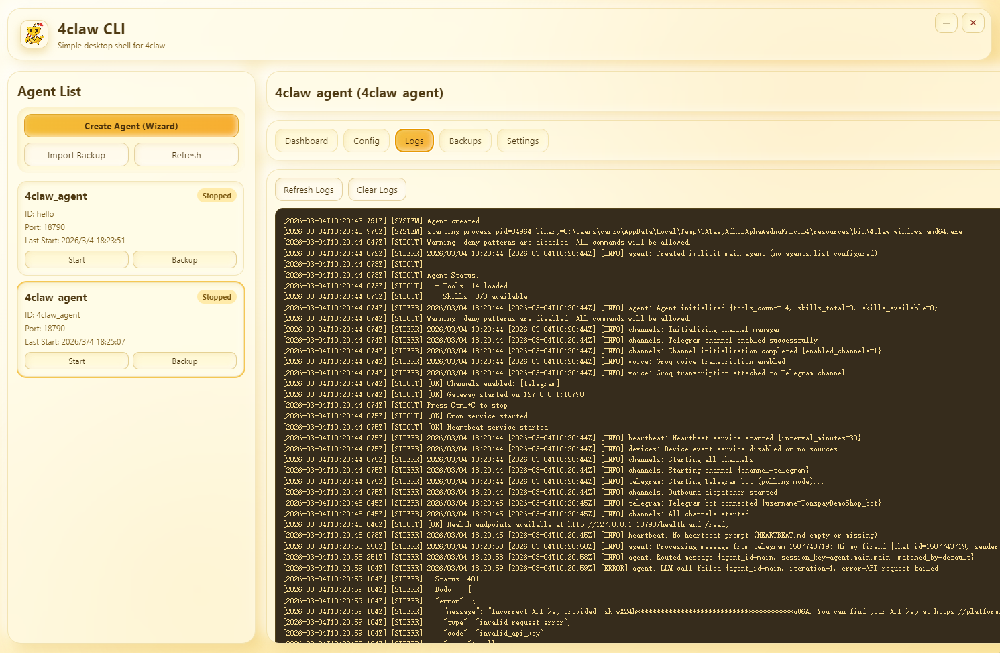

<div align="center">
  <a href="./README.md"><kbd>English (Default)</kbd></a>
  <a href="./README.zh.md"><kbd>简体中文</kbd></a>
  <a href="./README.ja.md"><kbd>日本語</kbd></a>
  <a href="./README.fr.md"><kbd>Français</kbd></a>
  <a href="./README.pt-br.md"><kbd>Português (Brasil)</kbd></a>
  <a href="./README.vi.md"><kbd>Tiếng Việt</kbd></a>
</div>

<br />

<div align="center">
  
</div>

<div align="center">
  
</div>

# 4claw Agent Core

Este diretório `agent/` é o **processo central de execução** usado pelo desktop `cli/`.

Em resumo:

- `agent/` = motor principal (binário Go, parsing de configuração, ferramentas, runtime gateway)
- `cli/` = interface visual (Electron, gerenciamento de agentes, UX de janela e bandeja)

## Relação com o `cli/`

O app de desktop não substitui o runtime. Ele controla o runtime:

1. escreve `config.json`
2. inicia/para `4claw gateway --config ...`
3. lê logs em tempo real
4. gerencia backup/importação/exportação

Portanto, `agent/` é o núcleo real de processamento; `cli/` é o plano de controle.

## Capacidades principais em `agent/`

- Runtime em Go com binário único
- Modo gateway para canais externos
- Roteamento de modelos/providers por configuração
- Sistema de ferramentas (filesystem, shell, web, agendamento, skills)
- Loop de execução de agentes e orquestração de tarefas
- Implantação portátil orientada por configuração

## Capturas da UI `cli/` (camada de controle)

Mesmo sendo um repositório core, abaixo estão as telas do desktop que o opera:

### Painel principal


### Painel de configurações



## Estrutura do repositório

- `cmd/`: pontos de entrada e comandos
- `config/`: exemplos e padrões de configuração
- `internal/`: lógica principal
- `docs/`: documentação e roadmap
- `docs/images/`: logo/banner/screenshots usados nos README

## Início rápido

```bash
make deps
make build
```

Executar em modo gateway:

```bash
./4claw gateway
```

Com configuração customizada:

```bash
./4claw gateway -c /path/to/config.json
```

## Fluxo típico com o desktop

1. Build/download do binário neste `agent/`.
2. Colocar o binário em `cli/resources/bin/`.
3. Iniciar a aplicação `cli/`.
4. Operar múltiplos agentes pela interface.

## Benefícios dessa separação

- Runtime mais leve e portátil
- UI desacoplada do core, com evolução mais rápida
- Uso headless em servidores sem interface
- Operação visual segura para múltiplas instâncias

## License

MIT
